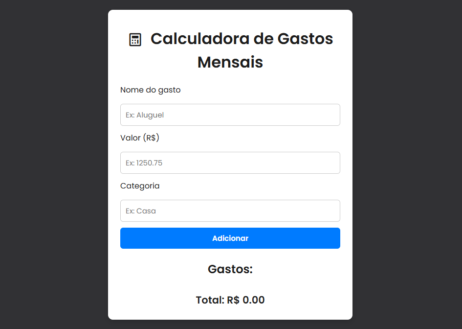

# APS de Frontend

## 🚀 Tecnologias

Esse projeto foi desenvolvido com as seguintes tecnologias:

- HTML5 e CSS3
- JavaScript
- Git e Github

## 💻 Projeto

Esse projeto se trata da elaboração de uma aplicação web simples para a **Atividade Prática Supervisionada (APS)** de **Programação Frontend**. 

O projeto foi desenvolvido com **HTML**, **CSS** e **JavaScript** para ajudar usuários a registrarem e visualizarem seus gastos mensais. Os dados são salvos localmente no navegador usando `localStorage`.

- [Acesse o projeto finalizado, online](https://lealistic.github.io/aps-frontend/)

## 📝 Licença

Esse projeto está sob a licença MIT.
